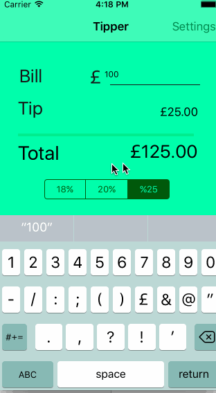

# Pre-work - Tipper

Tipper  is a tip calculator application for iOS.

Submitted by:  Jason Bautista

Time spent: a few hours spent in total, not sure, an afternoon or so

## User Stories

The following **required** functionality is complete:

* [x] User can enter a bill amount, choose a tip percentage, and see the tip and total values.
* [x] Settings page to change the default tip percentage.

The following **optional** features are implemented:
* [x] UI animations
* [ ] Remembering the bill amount across app restarts (if <10mins)
* [x] Using locale-specific currency and currency thousands separators.
* [x] Making sure the keyboard is always visible and the bill amount is always the first responder. This way the user doesn't have to tap anywhere to use this app. Just launch the app and start typing.

The following **additional** features are implemented:

- [ ] List anything else that you can get done to improve the app functionality!
[x] ui styling / launch screen

## Video Walkthrough 

Here's a walkthrough of implemented user stories:

GIF created with [LiceCap](http://www.cockos.com/licecap/).

## Notes

For some reason the launcher page did no update right away, it did so randomly eventually without me doing anything.
Getting an Int from a dictioanry will return if it's not set, odd, expected nil.

